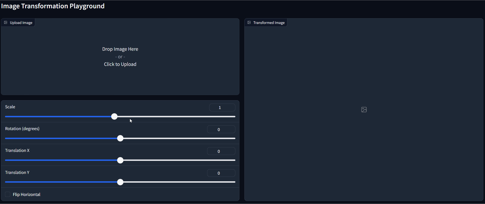
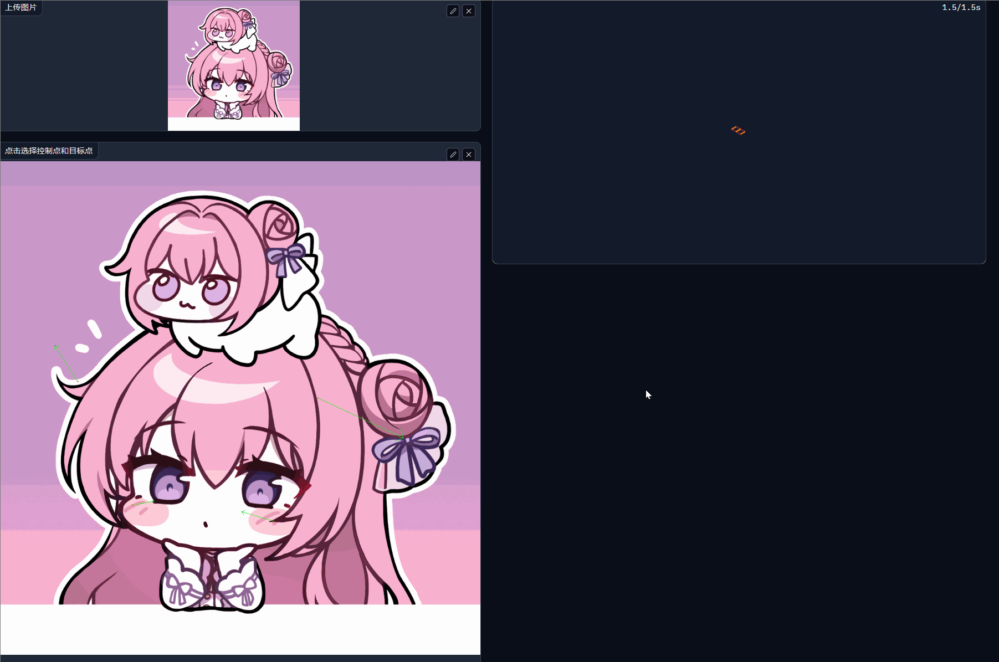

## DIP作业1     图像几何变换和基于点的MLS变形


## 简介
 
本项目实现了图像的基本变换功能，包括：

图像的旋转、平移、缩放和镜像处理。
基于点的MLS（Moving Least Squares）变形。
MLS变形
MLS变形通过 mls_affine 函数实现，该函数用于对单个点进行变形计算。

性能优化
为了提高MLS变形的效率，我们采用了以下方法：

使用 joblib 实现并行运算。
将 NumPy 数组转换为 CuPy（cp）数组，以利用GPU加速。
然而，上述优化效果并不理想，原因如下：

mls_affine 函数主要是对单个点进行变形后坐标的计算，其内部运算量有限，通常不超过百次。因此，无论是并行计算还是GPU加速，提升效率的空间都比较有限，时间主要浪费在对函数的调用、数据类型的转换和传递。NumPy类型数组本身就支持并行运算，因此并行处理带来的效率提升并不明显；而转化为CuPy数组后，反而增加了处理时间。

改进方案
我们目前采用网格分割图像的方法，对网格顶点进行转换。随后，针对每个网格内部，计算其对应的整体仿射矩阵，并批量进行转换。然而，由于实施的是正向映射（即计算原图像像素点在变形后图像中的新坐标），这会导致变形后图像的一些点未被映射，从而出现黑线现象。

由于时间限制，未能采用反向映射的方法来解决黑线问题，而是使用了后期处理的方法，包括中值滤波、双线性插值和三次插值等，虽然如此，仍然无法完全避免黑线现象的发生。

未来的优化方向
GPU加速方案的失败可以通过直接修改函数实现来解决，即将整个图像的像素点转为向量，并同时计算其变形后的位置。不过由于时间原因，未能在当前版本中实现这一思路。

## Requirements

To install requirements:

```setup
python -m pip install -r requirements.txt
```
注：本次作业使用conda（conda-forge） 安装的gradio包版本为 3.46.1，版本过高有bug（gr.Image不支持参数source, 且不支持点选取）

## Running

To run basic transformation, run:

```basic
python run_global_transform.py
```

To run point guided transformation, run:

```point
python run_point_transform.py
```

## Results (need add more result images)
### Basic Transformation



### Point Guided Deformation:



更多效果图在pics文件夹内

蓝色为控制点 青色为目标点，绿色是变形前网格，红色是变形后网格。
关闭网格显示，可删除run_point_transform.py网格绘制之后的内容。

## Acknowledgement

>📋 Thanks for the algorithms proposed by [Image Deformation Using Moving Least Squares](https://people.engr.tamu.edu/schaefer/research/mls.pdf).
