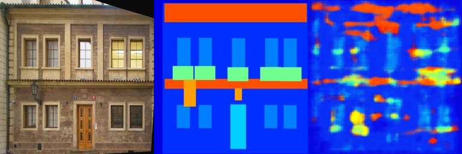
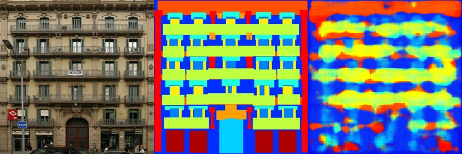
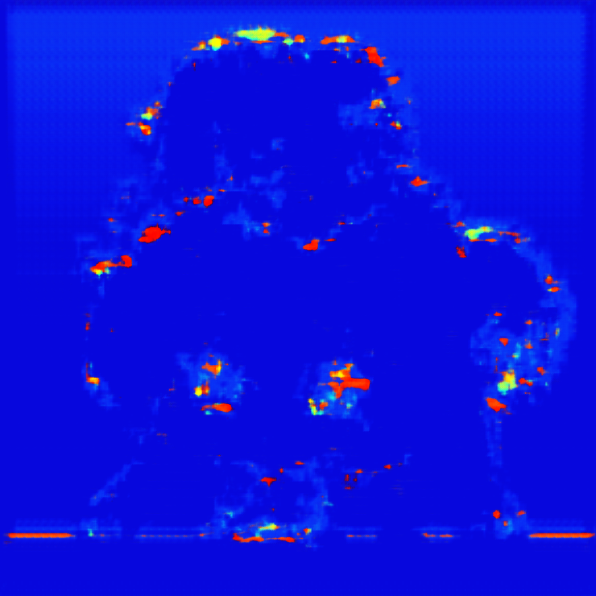

## DIP 作业 2：DIP_with_PyTorch

## 功能描述
part 1. Poisson 图像编辑
   使用opencv库实现多边形蒙版计算

   laplace_loss 计算基于下图（4）
   

在loss函数：用拉普拉斯卷积核[[0, 1, 0], [1, -4, 1], [0, 1, 0]]求出各点散度，并计算与前景图像各点散度插值方差和，
，迭代优化poisson方程，降低loss，得出近似解。

part 2. pix2pix
   为FCN添加一些卷积层和对应的反卷积层，作为生成器。
    添加判别器Discriminator
    判别器负责对输入值（条件，结果）二元组判断是否为伪造，并对每个层结果输出[0,1]的真假概率；对于真实组，1-判断结果的差值+伪造组的判断值，即为判别器的损失。
    生成器通过条件，生成结果，其损失值为与真实组的差距+骗过判别器的值
    判别器学习速度慢于生成器

## 前置要求

    conda install -c conda-forge opencv
    conda install pytorch 12.4
    bash download_facades_dataset.sh

## 运行程序

    1.泊松图像编辑
        进入目录：
        cd Assignments\02_DIPwithPyTorch/
        run: p
        python run_blending_gradio.py 

    2.pix2pix
        进入目录：
        cd Assignments\02_DIPwithPyTorch/Pix2Pix/
        run:
        python train.py  

## Results

1.泊松图像编辑
<!-- 第一行 -->

    
    

<!-- 第二行 -->

    
    

    

2.pix2pix

单生成器800epoch效果：
<!-- 前两个图像各自单独一行 -->

    

    

<!-- 后两个图像在同一行显示 -->

    
    

cGAN

100epoch效果:

## 训练集结果

    
    

## 验证集结果

    
    

## 理论基础

📋 参考资料:
- [Poisson Image Editing](https://www.cs.jhu.edu/~misha/Fall07/Papers/Perez03.pdf)
- Image-to-Image Translation with Conditional Adversarial Nets - [PDF](https://arxiv.org/abs/1611.07004)
- Fully Convolutional Networks for Semantic Segmentation - [PDF](https://arxiv.org/abs/1605.06469)